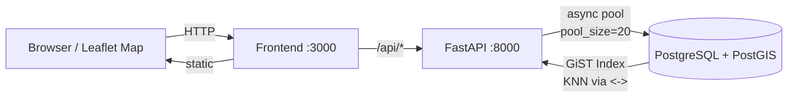

# Documentacion de Arquitectura

## Diagrama General



**Tres contenedores** via Docker Compose:

| Contenedor | Tecnologia | Responsabilidad |
|------------|-----------|-----------------|
| **db** | PostGIS 16-3.4 | Almacenamiento, indice espacial GiST, advisory locks para concurrencia |
| **api** | FastAPI + SQLAlchemy 2.0 + GeoAlchemy2 | API REST async, validacion con Pydantic, documentacion OpenAPI automatica |
| **frontend** | Python HTTP server + Leaflet.js | Mapa interactivo, proxy reverso a la API |

## Decisiones de Arquitectura

### PostgreSQL + PostGIS para busqueda espacial

**Problema**: Encontrar las K estaciones mas cercanas a un punto GPS. Un scan secuencial es O(n), inaceptable a 10,000+ estaciones.

**Solucion**: PostGIS con indice GiST y el operador KNN `<->`, que da busquedas O(log n). A 10,000 estaciones, esto es ~1800x mas rapido que scan secuencial.

**Alternativas consideradas**:

| Alternativa | Por que no |
|-------------|-----------|
| Haversine en Python | O(n) por query, no escala |
| Geohash + filtro | Aproximado, problemas en bordes de celdas |
| Elasticsearch geo | Otra dependencia, over-engineering para este caso |
| **PostGIS GiST** | **O(log n), integrado en PostgreSQL, probado en produccion** |

```sql
-- KNN query: el indice GiST hace que ORDER BY + LIMIT use index scan, no sequential scan
SELECT *, geom <-> ST_SetSRID(ST_MakePoint(-103.35, 20.67), 4326) AS dist
FROM stations
ORDER BY geom <-> ST_SetSRID(ST_MakePoint(-103.35, 20.67), 4326)
LIMIT 5;
```

### Advisory Locks para concurrencia en reservaciones

**Problema**: 200 usuarios intentan reservar la misma bicicleta simultaneamente. Sin control de concurrencia, se produce overselling (vender mas bicicletas de las disponibles).

**Solucion**: `pg_advisory_xact_lock(station_id)` serializa las reservaciones por estacion dentro de una transaccion. El lock se libera automaticamente al hacer commit o rollback.

**Alternativas consideradas**:

| Alternativa | Pros | Contras |
|-------------|------|---------|
| `SELECT FOR UPDATE` | Estandar SQL | Puede causar deadlocks en operaciones multi-fila |
| Optimistic locking (version column) | Sin bloqueo | Requiere logica de retry en el cliente |
| **Advisory lock** | **Explicito, sin deadlocks, sin retries** | **Especifico de PostgreSQL** |

**Evidencia**: El test `test_no_oversell` dispara 200 requests concurrentes contra una estacion con 10 bicicletas. Resultado: exactamente 10 exitosas, 190 rechazadas con 409, 0 oversells.

### Monolito sobre microservicios

**Problema**: Como estructurar la aplicacion. Microservicios agregarian latencia de red entre servicios, complejidad de deployment, y el problema de transacciones distribuidas (reservar una bici requiere leer y escribir en la misma transaccion).

**Solucion**: Un solo servicio FastAPI, una sola base de datos. El connection pool async (pool_size=20, max_overflow=30) maneja la concurrencia sin problemas a esta escala.

### FastAPI async sobre Flask/Django

**Por que**: FastAPI con SQLAlchemy async permite manejar multiples requests concurrentes sin bloquear el event loop. Esto es critico para el test de throughput (1,000 requests concurrentes). Ademas, genera documentacion OpenAPI/Swagger automatica en `/docs`.

## Tech Stack

| Layer | Technology |
|-------|-----------|
| API | FastAPI |
| ORM | SQLAlchemy 2.0 + GeoAlchemy2 |
| Migrations | Alembic |
| Database | PostgreSQL 16 + PostGIS 3.4 |
| Spatial Index | GiST (R-tree) |
| Concurrency | pg_advisory_xact_lock |
| Frontend | Leaflet.js + vanilla HTML/JS |
| Containers | Docker Compose |
| CI | GitHub Actions |
| Testing | pytest + pytest-asyncio + httpx |

---

**Siguiente**: [Instrucciones de Setup](setup.md)
