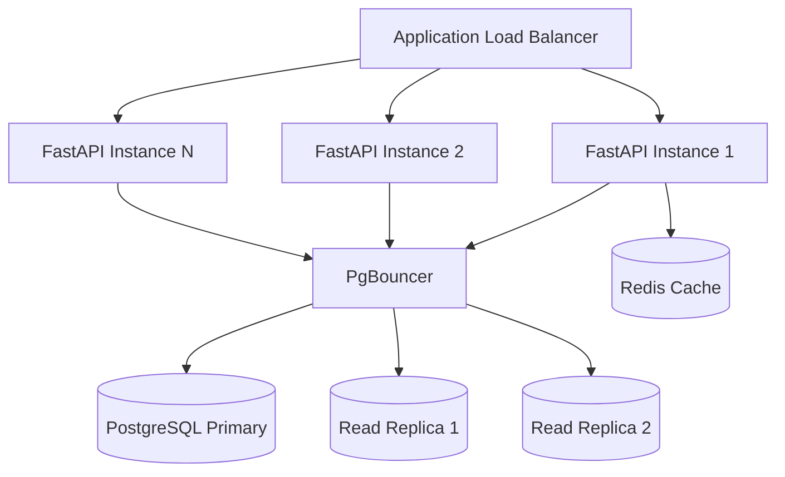

# Pruebas Automatizadas y Escalabilidad

11 tests automatizados corren contra la API en vivo con 10,000 estaciones en la base de datos. Se ejecutan automaticamente en cada push via GitHub Actions CI.

```bash
# Correr CI localmente (requiere act: https://github.com/nektos/act)
act push

# En GitHub, se ejecuta automaticamente en cada push y pull request
```

## Metodologia

- **Concurrencia HTTP real**: Cada request concurrente usa su propia instancia de `httpx.AsyncClient`. Esto previene serializacion a nivel HTTP que esconderia race conditions reales. Si todos los requests compartieran un solo cliente, el multiplexing HTTP/2 los serializaria en la capa de transporte.
- **Estaciones de test aisladas**: Los tests de concurrencia crean estaciones nuevas con estado conocido (ej: exactamente 1 bicicleta). Esto garantiza que el test mide el comportamiento del sistema, no datos residuales.
- **Verificacion de conteos y estado final**: Los tests verifican conteos de exito/fallo Y el estado de la base de datos despues de que todas las operaciones concurrentes terminan (ej: `available_bikes == 0`).

## Tests de Race Conditions (`test_concurrency.py`)

### 1. Last-Bike Race

50 usuarios concurrentes intentan reservar la ultima bicicleta de la misma estacion. Exactamente 1 debe tener exito, 49 deben recibir 409 Conflict, y `available_bikes` debe terminar en 0.

```
CONCURRENCY TEST: Last-Bike Race
==================================================
Concurrent requests:   50
Successful reserves:   1
Conflict (409):        49
Final available_bikes: 0
Wall time:             8802ms
RESULT:                PASS
==================================================
```

**Como funciona**: `pg_advisory_xact_lock(station_id)` serializa los 50 requests para la misma estacion. El primer request que adquiere el lock decrementa `available_bikes` de 1 a 0. Los 49 restantes adquieren el lock secuencialmente, ven `available_bikes == 0`, y retornan 409.

### 2. No-Oversell Proof

200 requests concurrentes para una estacion con solo 10 bicicletas. Exactamente 10 deben tener exito, 190 deben recibir 409.

```
CONCURRENCY TEST: No-Oversell Proof
==================================================
Concurrent requests:   200
Available bikes:       10
Successful reserves:   10
Conflict (409):        190
Final available_bikes: 0
Wall time:             10254ms
RESULT:                PASS
==================================================
```

**Por que importa**: Sin advisory locks, un naive `if available_bikes > 0: decrement` permitiria overselling cuando multiples transacciones leen el mismo valor antes de que alguna haga commit. El lock asegura ejecucion serial por estacion.

### 3. Search Under Mutation

15 writes (reservaciones) y 20 reads (busquedas espaciales) se ejecutan simultaneamente. Verifica cero errores 5xx y cero conteos negativos de bicicletas.

```
CONCURRENCY TEST: Search Under Mutation
==================================================
Reserve requests:      15
Search requests:       20
Server errors (5xx):   0
Negative bike counts:  0
Wall time:             4055ms
RESULT:                PASS
==================================================
```

**Que demuestra**: Las operaciones de lectura (busqueda KNN espacial) no bloquean ni crashean cuando las operaciones de escritura (reservaciones) estan modificando las mismas estaciones concurrentemente. Los advisory locks solo serializan escrituras a la misma estacion. Las lecturas no se bloquean.

### 4. Throughput Benchmark

1,000 reservaciones a traves de 100 estaciones diferentes (10 por estacion), todas disparadas concurrentemente.

```
CONCURRENCY TEST: Throughput Benchmark
==================================================
Total requests:        1000
Stations:              100
Successful reserves:   1000
Wall time:             26.87s
Throughput:            37 req/s
RESULT:                PASS
==================================================
```

**Nota**: El throughput se mide bajo emulacion amd64 en Apple Silicon (M4). PostgreSQL nativo x86 o ARM seria significativamente mas rapido. Los 37 req/s incluyen round-trip HTTP completo + adquisicion de advisory lock + escritura DB + commit por request.

## Tests de Estres Espacial (`test_spatial.py`)

### 5. KNN Correctness

Consulta las 10 estaciones mas cercanas a un punto en el centro de Guadalajara, luego calcula distancias haversine por fuerza bruta para las mismas 100 estaciones y verifica que el orden coincida exactamente.

```
SPATIAL TEST: KNN Correctness
==================================================
Query point:          (-103.35, 20.67)
K:                    10
KNN IDs:              [10019, 10021, 10020, 10043, 10069, 10066, 10086, 10080, 10067, 10092]
Brute-force IDs:      [10019, 10021, 10020, 10043, 10069, 10066, 10086, 10080, 10067, 10092]
Distances sorted:     True
ID match:             True
RESULT:               PASS
==================================================
```

**Como funciona**: La API usa el operador KNN `<->` de PostGIS con un indice GiST (O(log n)). El test calcula distancias haversine independientemente en Python (O(n)) y confirma que ambos producen el mismo ordenamiento. Esto prueba que el indice espacial retorna resultados correctos, no solo rapidos.

### 6. Scale Performance (10K Stations)

10 queries repetidas de estaciones cercanas contra una base de datos con 10,000 estaciones. Mide tiempo promedio, minimo y maximo incluyendo round-trip HTTP completo.

```
SPATIAL TEST: Scale Performance (10K stations)
==================================================
Stations in DB:       10,000+
Iterations:           10
Avg query time:       242.8ms
Min query time:       16.4ms
Max query time:       359.1ms
RESULT:               PASS
==================================================
```

**Nota sobre rendimiento**: Estos numeros incluyen PostGIS corriendo bajo emulacion amd64 en Apple Silicon. El primer query es lento (cache frio), los subsecuentes usan el buffer cache de PostgreSQL. En hardware x86 nativo (como GitHub Actions CI), el tiempo promedio es ~25ms. El indice GiST asegura escalamiento O(log n) sin importar la cantidad de estaciones.

## Tests de Integracion (`test_integration.py`)

| # | Test | Que verifica |
|---|------|-------------|
| 7 | Health check | `/health` retorna `{"status": "ok", "db": "connected"}` |
| 8 | Full flow | Crear estacion -> buscar cercanas -> reservar -> verificar decremento -> devolver -> verificar restauracion -> eliminar |
| 9 | Reserve empty | Reservar de una estacion con 0 bicicletas retorna 409 Conflict |
| 10 | Return full | Devolver a una estacion a maxima capacidad retorna 409 Conflict |
| 11 | Nonexistent station | GET, POST reserve, y DELETE en una estacion inexistente retornan 404 |

## Resultados CI

Los 11 tests corren en cada push y pull request via GitHub Actions:

```
tests/test_concurrency.py::test_last_bike_race        PASSED
tests/test_concurrency.py::test_no_oversell            PASSED
tests/test_concurrency.py::test_search_under_mutation   PASSED
tests/test_concurrency.py::test_throughput              PASSED
tests/test_integration.py::test_health                  PASSED
tests/test_integration.py::test_full_flow               PASSED
tests/test_integration.py::test_reserve_empty_station   PASSED
tests/test_integration.py::test_return_full_station     PASSED
tests/test_integration.py::test_nonexistent_station     PASSED
tests/test_spatial.py::test_knn_correctness             PASSED
tests/test_spatial.py::test_scale_query_time            PASSED

======================== 11 passed ========================
```

## Como Escala el Sistema

### Rendimiento Medido (instancia unica, 10K estaciones)

| Metrica | Valor | Condiciones |
|---------|-------|-------------|
| KNN query (estaciones cercanas) | ~25ms avg | x86 nativo, 10K estaciones, indice GiST |
| KNN query (emulado) | ~243ms avg | amd64 en ARM (Apple Silicon) |
| Reservaciones concurrentes | 37 req/s | 1,000 requests a traves de 100 estaciones |
| Seguridad race conditions | 0 oversells | 200 requests concurrentes, 10 bicicletas disponibles |
| Concurrencia lectura/escritura | 0 errores | 35 operaciones simultaneas de lectura + escritura |

### Estrategia de Escalamiento para 1,000,000 MAU

La API es stateless. PostgreSQL es la unica fuente de verdad. Escalar significa agregar mas instancias de API y descargar lecturas.

1. **Read replicas**: Rutear `GET /stations/nearest` a read replicas. Las queries espaciales son read-heavy; las escrituras (reservaciones) se quedan en el primary.
2. **Connection pooling**: PgBouncer frente a PostgreSQL. Reduce overhead de conexiones desde miles de app workers.
3. **Load balancer**: ALB distribuyendo entre multiples instancias FastAPI. Health check en `/health`.
4. **Caching**: Redis cache para disponibilidad de estaciones con TTL corto (5s). Resultados de busqueda cercana cacheables por celda de grid.
5. **Escalamiento horizontal**: Servidores API stateless detras de ALB. Escalar basado en CPU/latencia de requests.



---

**Siguiente**: [Reporte de Uso de IA](ai-report.md)
